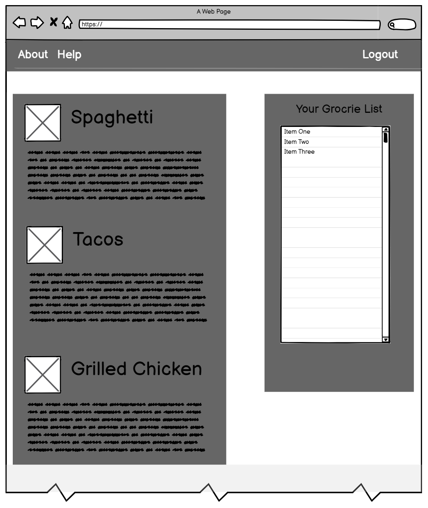

# Alex Fargo MSSE 661 Final Project
## Grocery List Helper App

This is my class project application for the MSSE 661 Web Development class. This application uses Express and Mongo on the backend and vanilla JavaScript and HTML/CSS on the front end.

The purpose of the application is to allow users to browse a collection of recipes, select ones they want to make for the week, and then dynamically build a grocery list for them based on the ingredients in the recipe. Some of the key features I want to implement for this application are as follows:

- Basic registration
- Basic authentication
- Returning and presenting a list of recipes from a database 
- Dynamically generating a grocery list based on selected recipes 

A rough mockup of the main page is as follows:

